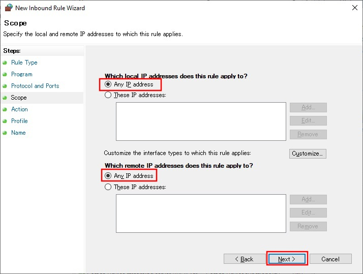

# socks5 dcom

socks5 server and client (Windows DCOM)

[!CAUTION]

By default, remote access of DCOM is not allowed.

Use only for testing purposes.

## Build
### Build dependencies
- visual studio community (Desktop development with C++)
    1. install Desktop development with C++

### Build
1. download files
```
git clone https://github.com/shuichiro-endo/socks5.git
```
2. run x64 Native Tools Command Prompt for VS 2022
3. build
```
cd socks5\Windows-dcom
compile_server.bat
compile_client.bat
```
4. copy socks5\Windows-dcom directory to client and server

## Install
### Install
- server
1. run command prompt
2. copy files (socks5server.exe and socks5server_proxy.dll) to C:\socks5\server directory
```
cd Windows-dcom
copy_files.bat
```
3. run command prompt (administrator authorization is required)
4. add new subkeys and entries of a stub to the registry
```
cd Windows-dcom
register_proxystub.bat
```
5. add new subkeys and entries of socks5server to the registry
```
register_socks5server.bat
```
- client
1. run command prompt
2. copy file (socks5server_proxy.dll) to C:\socks5\server directory
```
cd Windows-dcom
copy_files.bat
```
3. run command prompt (administrator authorization is required)
4. add new subkeys and entries of a proxy to the registry
```
cd Windows-dcom
register_proxystub.bat
```

### Set up DCOM
[!CAUTION]

By default, remote access of DCOM is not allowed.

The following settings are dangerous.

Use only for testing purposes.
- server (e.g. Windows Server 2022)
    1. run dcomcnfg (administrator authorization is required)
    
    
    
    
    
    
    
    
    
    
    
    
    
    
    
    
    2. run windows defender firewall with advanced security (administrator authorization is required)
    
    
    
    
    
    
    
    
    
    3. run local security policy (administrator authorization is required)
    
    
    
    
    
    
    
    
    
    
    
    4. restart server

## Usage
- client
```
usage        : client.exe -h socks5_listen_ip -p socks5_listen_port -H socks5server_ip
             : [-A recv/send tv_sec(timeout 0-10 sec)] [-B recv/send tv_usec(timeout 0-1000000 microsec)] [-C forwarder tv_sec(timeout 0-3600 sec)] [-D forwarder tv_usec(timeout 0-1000000 microsec)]
example      : client.exe -h 192.168.0.5 -p 9050 -H 192.168.0.10
             : client.exe -h localhost -p 9050 -H 192.168.0.10
             : client.exe -h ::1 -p 9050 -H 192.168.0.10 -A 3 -B 0 -C 3 -D 0
             : client.exe -h 192.168.0.5 -p 9050 -H 192.168.0.10 -A 30 -C 30
             : client.exe -h fe80::xxxx:xxxx:xxxx:xxxx%14 -p 9050 -H 192.168.0.10 -A 30 -C 30
```

