# socks5 rpc

socks5 server and client (Windows RPC)

## Build
### Install dependencies
- visual studio community (Desktop development with C++)
    1. install Desktop development with C++

### Build
1. download files
```
git clone https://github.com/shuichiro-endo/socks5.git
```
2. run x64 Native Tools Command Prompt for VS 2022
3. build
```
cd socks5\Windows-rpc
compile.bat
```
4. copy socks5\Windows-rpc directory to client and server computers

## Install
### Set up RPC
- server
    1. run local group policy (administrator authorization is required)
    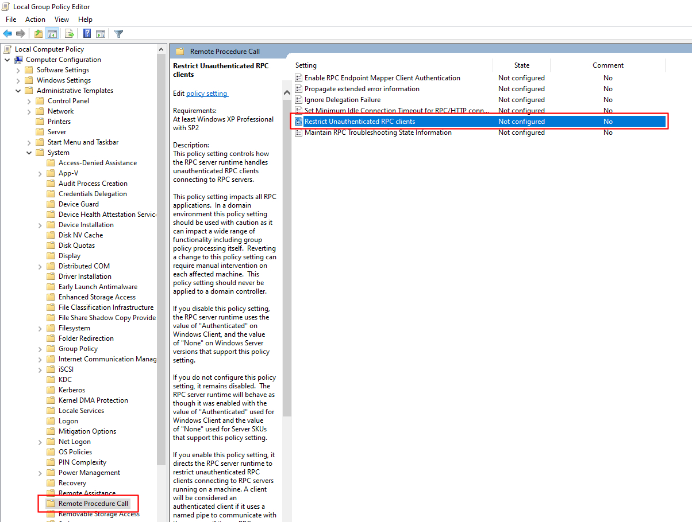
    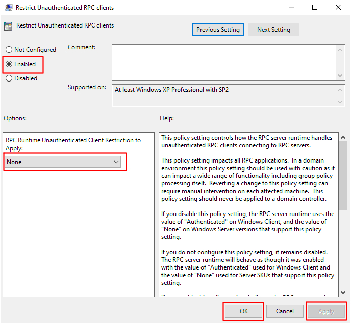
    2. run windows defender firewall with advanced security (administrator authorization is required)
    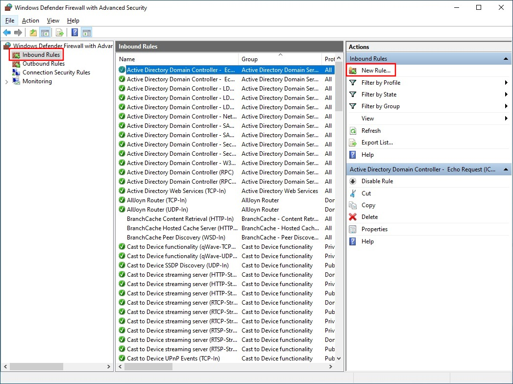
    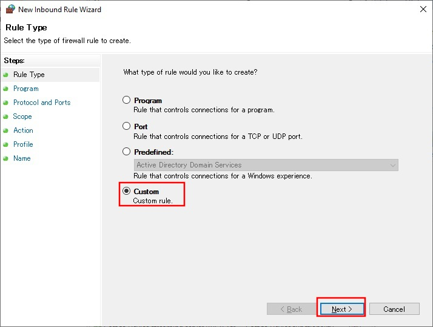
    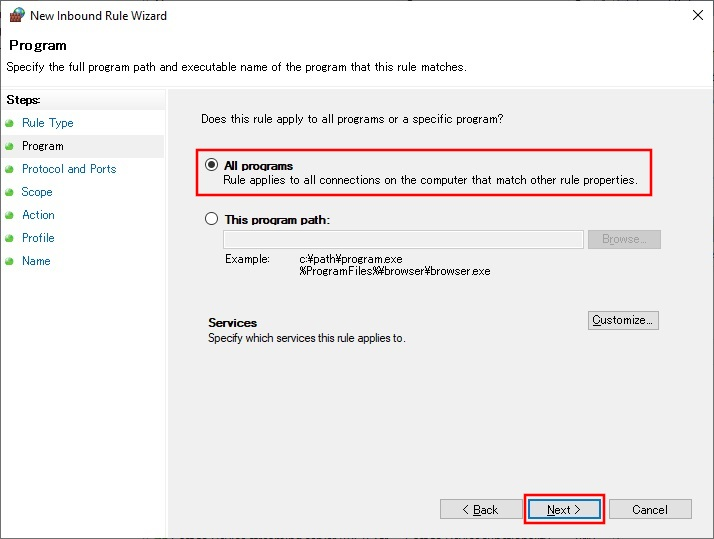
    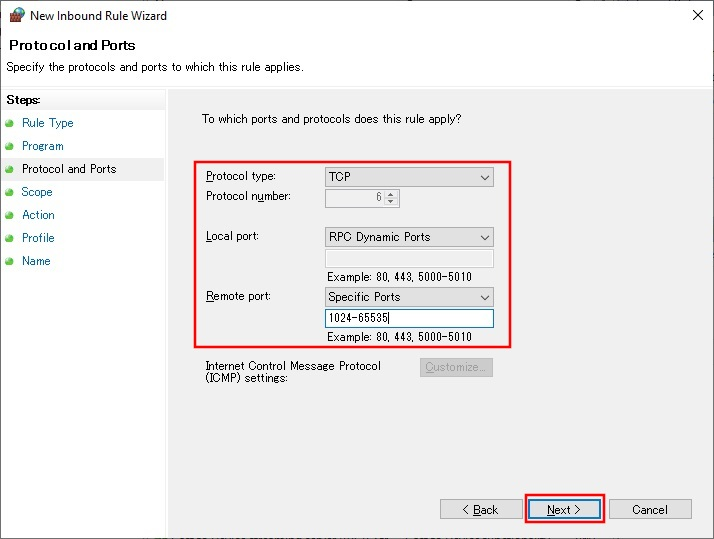
    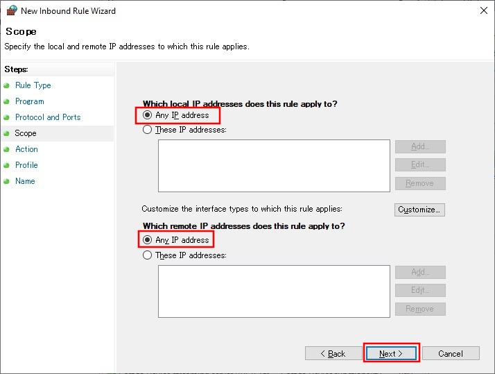
    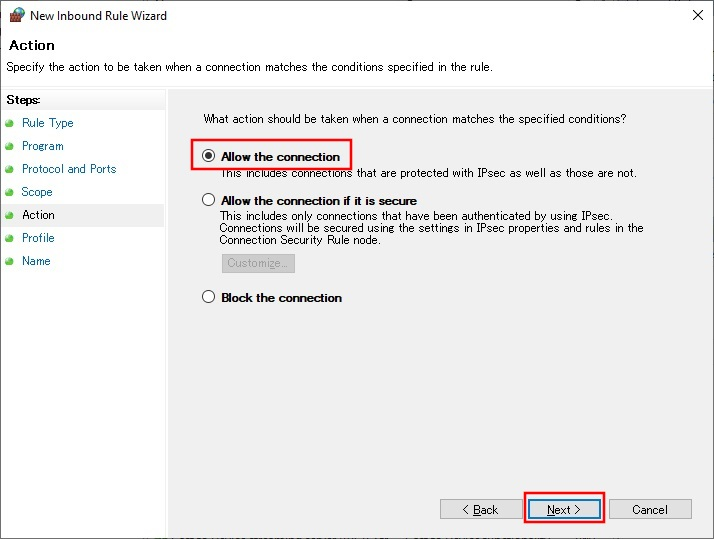
    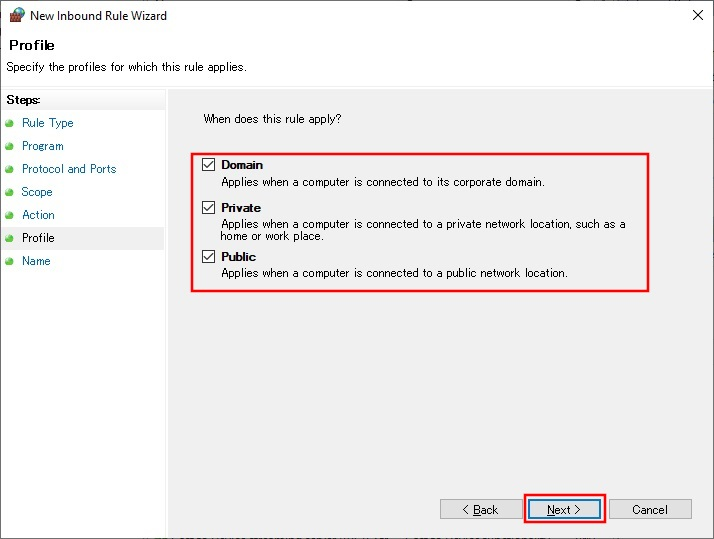
    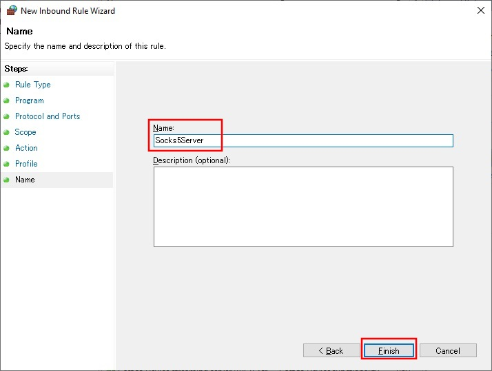
    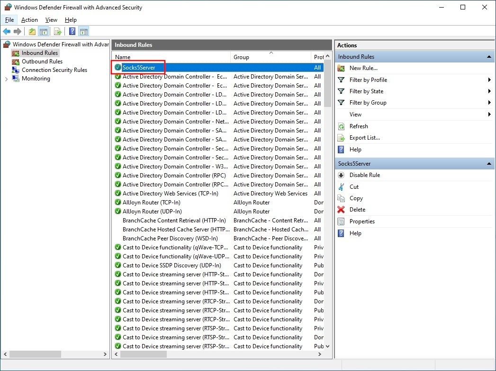
    3. run socks5server.exe and add firewall rules (The first time only. Depending on the execution environment, additional rules may not be necessary.)
    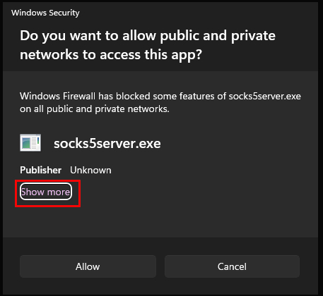
    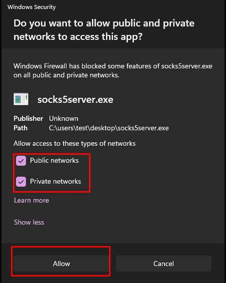
    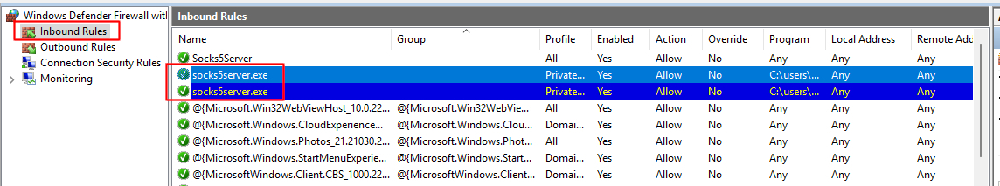
    4. stop socks5server.exe (ctrl+c) and restart server

## Usage
- client
```
usage        : client.exe -h socks5_listen_ip -p socks5_listen_port -H socks5server_netbios_name
             : [-A recv/send tv_sec(timeout 0-10 sec)] [-B recv/send tv_usec(timeout 0-1000000 microsec)] [-C forwarder tv_sec(timeout 0-3600 sec)] [-D forwarder tv_usec(timeout 0-1000000 microsec)]
example      : client.exe -h 127.0.0.1 -p 9050 -H TESTPC01
             : client.exe -h localhost -p 9050 -H TESTPC01
             : client.exe -h ::1 -p 9050 -H TESTPC01 -A 3 -B 0 -C 3 -D 0
             : client.exe -h 192.168.0.5 -p 9050 -H TESTPC01 -A 30 -C 30
```

- server
```
usage        : socks5server.exe
             : [-p socks5server_rpc_endpoint]
example      : socks5server.exe
             : socks5server.exe -p 45000
```

